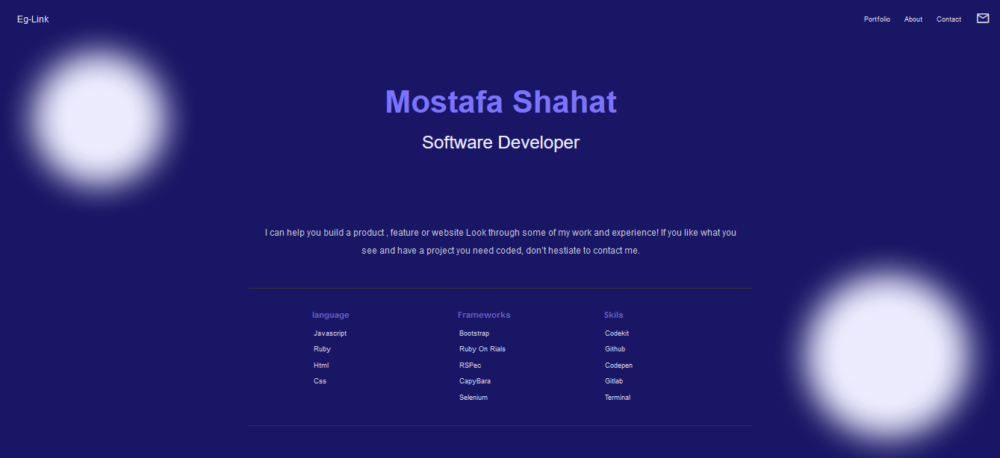
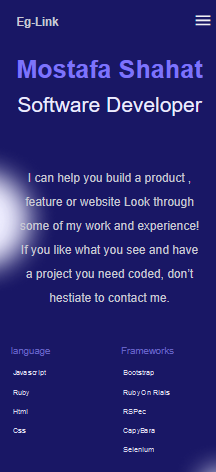

# Portfolio
Microverse Portfolio Project 
> Portfolio Web site.
## Portfolio Web site Project initialization
### In this project we :
- Add Linters for HTML/CSS.
- Use Mobile-first approach.
- Use best practices for HTML & CSS.
- Update README file.
- Add Mark up to the .html file.
- Add style to the main header.
- Use images and backgrounds to enhance the look of the website.
- Add second section (Work-About).
- Add contact Form.
- Add Desktop version with media queries.

## Screenshot
 
 
 

## Built With

- HTML(HTML-5)
- CSS(Flexbox - grid)

## Getting Started

1- clone Repo.
git clone git@github.com:MostafaShahat2021/portfolio.git

2- Install npm (node pakage manager)
**you can run any one of these commands to install npm on your machine:**
- npm i
- npm install
- sudo apt install npm

 **to install globally, just add a -g or --global after the install or i**
- npm i -g
- sudo apt install -g npm

## Live Demo:

[Live Demo Link](https://livedemo.com)

### Run tests

We use Linters for HTML/CSS to cheack this project.

## Authors

👤 **Mostafa Shahat**

- GitHub: [@MostafaShahat2021](https://github.com/MostafaShahat2021)
- LinkedIn: [LinkedIn](https://www.linkedin.com/in/mostafa-shahat-a75810208/)

## 🤝 Contributing

Contributions, issues, and feature requests are welcome!

Feel free to check the [issues page](../../issues/).

## Show your support

Give a ⭐️ if you like this project!

## 📝 License

This project is [MIT](./LICENSE) licensed.
